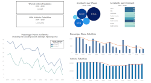

# Data Visualization

## Airline Crashes in the Media
Due to recent unfortunate airline crashes, the media has been promoting statistics stating air is no longer a safe way to travel. The news and media outlets have been bombarding the public with reports and figures about the trends of airline safety and that things are not looking good. What was previously thought as the safest way to travel, especially when compared to automobiles, is now being presented as one of the most dangerous to the public. But are any of these claims based on facts?

You work for an airline on the data science team as a data analyst and are a resident data visualization expert. You have been tasked with helping multiple groups in the organization combat this negative publicity and help tell the airline's side of the story. There is a fear internally about what this type of media coverage will do to airline sales and how it could impact the future of the company. Not only do they need you to help create some internal communications, but you will also be tasked with what is published to the public and the media

**5 Data Visualizations Projects**
1. Dashboard for internal use
2. Executive Summary for senior leaders
3. Blog Post for the public
4. Infographic for the public
5. Video Presentation (3 minute Story)

 
 

 
 

## Built With
Tableau, MS Word, MS Powerpoint